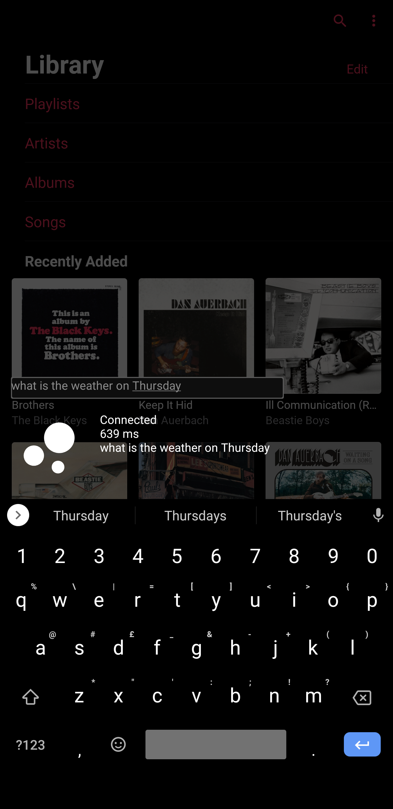

# unbot

A natural language assistant, written in Go.

unbot data stays private by keeping processing local and using external services only where necessary.

### Features:

Open-domain question answering utilising hashed bigram BM25 Wikipedia article selection (inspired by Facebook's DrQA) or 
DuckDuckGo instant answers, and SQuAD-finetuned DistillBERT for answer retrieval. Named-entity recognition allows for 
conversational flow.

```
Q: What device did Siri originally release on?
A: iPhone 4S

Q: What was the reception to its initial release?
A: Mixed reviews

Q: What happened to her in IOS 11?
A: Apple updated Siri's voices for more clear, human voices
```

Memory storage with natural recall. GloVe embeddings are used to determine if the answer to a question is stored as a 
memory or if it should be searched on the web. DistillBERT is again used for answer selection. By default, memories have 
an expiry time but can be marked for permanent storage.

```
Q: Remember my car is parked on Bond Street

Q: Where is my car parked?
A: Bond Street
```

Nearby aircraft information from OpenSky ADS-B data (operator, aircraft type, position relative to given location, 
current flight metrics).

```
Q: What plane is closest to Wembley?
A: British Airways 75M, AIRBUS A320-232, south-southwest, at 2350 feet, heading west
```

Weather information and sunrise/set times from OpenWeatherMap. Geocoding from OpenStreetMap's Nominatim search.

```
Q: What is the weather in Cardiff on Tuesday morning?
A: Moderate rain, 13 degrees, 92 percent humidity
```

Unit conversion.

```
Q: What is 5.2 kilos in pounds?
A: 11.46 pounds
```

Calculator for arithmetic operations.

```
Q: What is 5 + 3 - 4 * 10 / 7 ^ 3
A: 7.883380
```

---



Thank you @jdkato for the excellent [jdkato/prose](https://github.com/jdkato/prose)
